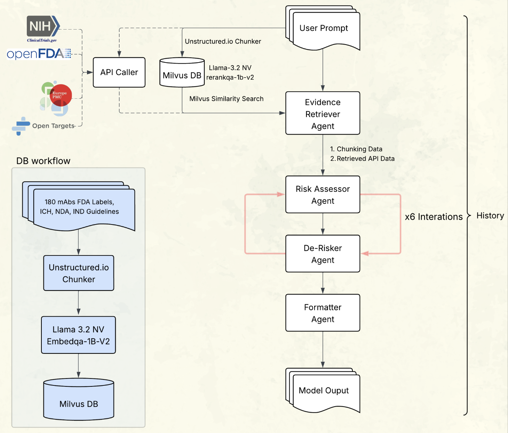
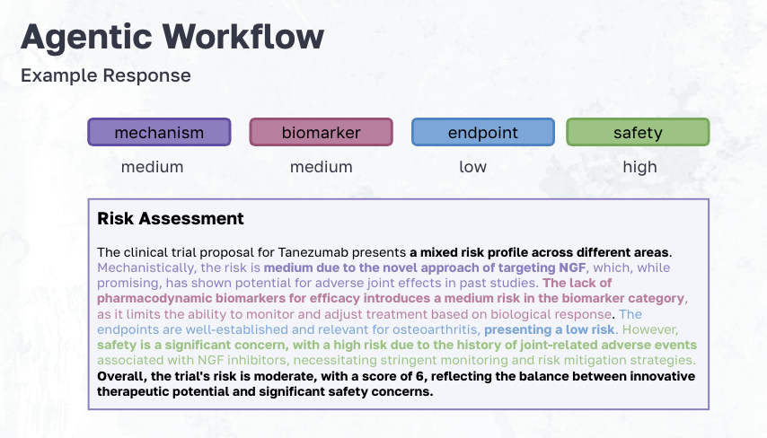

# Agentic Clincal Trial Derisker

Our project aimed to build an agentic workflow that de-risks development by analyzing a user’s proposal, benchmarking them against real-world successes and failures to: 
  1. Delivers actionable, evidence-based recommendations 
  2. Improve regulatory readiness and trial design

### Workflow

RAG Components

API Tools
- NIH ClinicalTrials.gov
- OpenFDA
- Europe PMC
- Open Targets

Agentic Workflow

Output Evaluation

### Example Output

Limitations

Future Directions

to come...

How to use...
